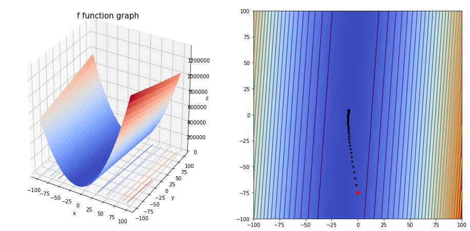

In this notebook, I'll try to implement the gradient descent algorithm, test it with few predefined functions and visualize its behabiour in order to coclude with the importance of each parameter of the algorithm.<br>
At the end, I will apply the gradient descent algorithm to minimize the mean squared error funcion of the least squares method.


```python
# Imports

%matplotlib inline
import numpy as np
import matplotlib.pyplot as plt
from mpl_toolkits.mplot3d import Axes3D
from matplotlib import cm
```


```python
# Test Funcions (inspired from https://en.wikipedia.org/wiki/Gradient_descent and http://www.numerical-tours.com/matlab/optim_1_gradient_descent/)

f = lambda x,y : (x-2)**2*(np.sin(y-1))**2+x**2+y**2
g = lambda x,y : (1-x)**2+100*(y-x**2)**2
h = lambda x,y : ( x**2 + 10*y**2 ) / 2
```


```python
# The partial derivatives

df = lambda x,y : np.array([2*x+2*(x-2)*(np.sin(y-1))**2, 2*y+(x-2)**2*np.sin(2*(y-1))])
dg = lambda x,y : np.array([2*(200*x**3-200*x*y+x-1), 200*(y-x**2)])
dh = lambda x,y : np.array([x,10*y])
```


```python
# Gradient descent

def grad(fun=h,                              # The function to minimize
         dfun=dh,                            # The partial derivatives
         init=np.array([1.5,1.5]),           # Starting point
         gamma=0.5,                          # Gradient step
         precision=0.01,                     # Precision
         max_iters=1000,                     # Maximum number of iterations
         xlim=(-2, 2),                       # X limits (for graphic representation)
         ylim=(-2, 2),                       # Y limits (for graphic representation)
         arrows=False,                       # Plot steps
         e=0.005):                           # Meshgrid stepsize (for graphic representation)
    
    X = np.arange(xlim[0],xlim[1], e)
    Y = np.arange(ylim[0],ylim[1], e)
    X, Y = np.meshgrid(X, Y)
    Z = fun(X, Y)
    cur_a = init
    
    fig = plt.figure(figsize=(16,8))
    # Representing the 3-D function
    ax = plt.subplot(121, projection = '3d')
    ax.plot_surface(X, Y, Z, cmap = cm.coolwarm, linewidth = 0, antialiased = False)
    ax.contour(X, Y, Z, zdir = 'z', offset = -0.8, cmap = cm.coolwarm)
    ax.set_title('f function graph', fontsize = 15)
    ax.set_xlabel('x')
    ax.set_ylabel('y')
    ax.set_zlabel('z')
    # Representing contours and the starting point
    ax = plt.subplot(122)
    plt.imshow(Z, extent = (xlim[0],xlim[1],ylim[0],ylim[1]), cmap=cm.coolwarm, origin = 'lower')
    plt.contour(X, Y, Z, 30)
    plt.plot(cur_a[0], cur_a[1], 'o', color='r')
    
    
    previous_step_size = 1 # To enter while loop
    iters = 0 # Iteration counter
    #print(previous_step_size > precision and iters < max_iters)
    
    while previous_step_size > precision and iters < max_iters:
        prev_a = cur_a
        cur_a = cur_a - gamma * dfun(prev_a[0], prev_a[1])
        previous_step_size = np.linalg.norm(cur_a - prev_a)
        if arrows:
            dx, dy = cur_a[0] - prev_a[0], cur_a[1] - prev_a[1]
            plt.arrow(prev_a[0], prev_a[1], dx, dy, length_includes_head=True, head_width=0.02)
        plt.plot(cur_a[0], cur_a[1], '.',color='k')
        iters += 1
    print("The final solution is ",cur_a)
    print('We obtain the solution with a '+str(precision)+' precision, after '+str(iters)+' iterations.')
    return cur_a
```

## <center>$f(x,y)=(x-2)^2*(sin(y-1))^2+x^2+y^2$</center> 


```python
grad(fun=f, 
     dfun=df, 
     init=np.array([-2,-2]), 
     gamma=0.05, 
     precision=1e-04, 
     max_iters=10000, 
     xlim=(-3, 3), 
     ylim=(-3, 3))
```

    The final solution is  [0.09269109 0.77872974]
    We obtain the solution with a 0.0001 precision, after 155 iterations.


    array([0.09269109, 0.77872974])


```python
grad(fun=f, 
     dfun=df, 
     init=np.array([-2,-2]), 
     gamma=0.2, 
     precision=1e-04, 
     max_iters=10000, 
     xlim=(-3, 3), 
     ylim=(-3, 3), 
     arrows=True)
```

    The final solution is  [0.0918675  0.77892566]
    We obtain the solution with a 0.0001 precision, after 36 iterations.


    array([0.0918675 , 0.77892566])


```python
grad(fun=f, 
     dfun=df, 
     init=np.array([-2,-2]), 
     gamma=0.5, 
     precision=1e-03, 
     max_iters=100, 
     xlim=(-3, 3), 
     ylim=(-3, 3), 
     arrows=1)
```

    The final solution is  [0.07586343 0.09220978]
    We obtain the solution with a 0.001 precision, after 100 iterations.


    array([0.07586343, 0.09220978])


As we can see, if we increase the step size ($\gamma$) from $0.05$ to $0.2$ we can converge to the minimum very fast ($36$ iterations instead of $155$). But after increasing the step size to $0.5$ the algorithm seems not to converge (at least after $10,000$ iterations).

## <center>$g(x,y)=(1-x)^2+100*(y-x^2)^2$</center></br>
<center></center>


```python
grad(fun=g, 
     dfun=dg, 
     init=np.array([0.5,0.5]),
     gamma=0.005, precision=1e-03, 
     max_iters=10000, 
     xlim=(0, 2), 
     ylim=(0, 2))
```

    The final solution is  [0.46330448 0.2853615 ]
    We obtain the solution with a 0.001 precision, after 10000 iterations.


    array([0.46330448, 0.2853615 ])


```python
grad(fun=g, 
     dfun=dg, 
     init=np.array([1.75,1.5]), 
     gamma=0.001, 
     precision=1e-05, 
     max_iters=10000, 
     xlim=(0, 2), 
     ylim=(0, 2), 
     arrows=1)
```

    The final solution is  [1.01127616 1.02272428]
    We obtain the solution with a 1e-05 precision, after 8019 iterations.


    array([1.01127616, 1.02272428])


```python
grad(fun=g,
     dfun=dg,
     init=np.array([0.7,0.5]),
     gamma=0.001, 
     precision=1e-05,
     max_iters=50000, 
     xlim=(0, 2), 
     ylim=(0, 2))
```

    The final solution is  [0.98892335 0.97792476]
    We obtain the solution with a 1e-05 precision, after 7166 iterations.


    array([0.98892335, 0.97792476])


TL;DR The starting point is important to get a convergent algorithm.

## <center>$h(x,y)=0.5*( x^2 + 10*y^2 )$</center> 


```python
grad(fun=h, 
     dfun=dh, 
     init=np.array([1.5,1.5]), 
     gamma=0.05, 
     precision=1e-03,
     max_iters=10000, 
     xlim=(-2, 2), 
     ylim=(-2, 2), 
     arrows=1)
```

    The final solution is  [1.82104767e-02 1.93870456e-26]
    We obtain the solution with a 0.001 precision, after 86 iterations.


    array([1.82104767e-02, 1.93870456e-26])


```python
grad(fun=h, dfun=dh, init=np.array([1.5,1.5]), gamma=0.05, precision=1e-01, max_iters=10000, xlim=(-2, 2), ylim=(-2, 2))
```

    The final solution is  [1.16067141 0.046875  ]
    We obtain the solution with a 0.1 precision, after 5 iterations.


    array([1.16067141, 0.046875  ])


Not enough iterations since fastly we reached a point where $||a_{n+1}-a_n||=||-\gamma\nabla h(a_n)||<precision=0.1$.

# Gradient Descent Algorithm applied to Least Squares Method

The least squares method consists of minimizing the Mean Squared Error function defined as :
$MSE(w_0,w_1)=\frac{1}{N}\sum_{i=1}^{N}{(f(x_i)-y_i)^2}=\frac{1}{N}\sum_{i=1}^{N}{(w_0+w_1x_i-y_i)^2}$


```python
from sklearn.datasets import make_regression
```


```python
N = 100 # Sample size
```


```python
# Generating dataset
X, y = make_regression(N, 1, noise=50)
X = np.array([k[0] for k in X])
```


```python
fig = plt.figure(figsize=(16,8))
plt.scatter(X,y,marker='.')
plt.show()
```


```python
mse = lambda w0,w1 : (1/N)*np.square(sum(w0+w1*X[i]-y[i] for i in range(N)))
```


```python
dmse = lambda w0,w1 : np.array([2*w0+(2*w1/N)*sum(X)-(2/N)*sum(y), 
                               (2/N)*sum(X[i]*(w0+w1*X[i]-y[i]) for i in range(N))])
```


```python
Xr = np.arange(-100,100, 0.1)
Yr = np.arange(-100,100, 0.1)
Xr, Yr = np.meshgrid(Xr, Yr)
Zr = mse(Xr, Yr)

fig_1 = plt.figure(figsize=(16,8))
ax = plt.subplot(121, projection = '3d')
ax.plot_surface(Xr, Yr, Zr, cmap = cm.coolwarm, linewidth = 0, antialiased = False)
ax.contour(Xr, Yr, Zr, zdir = 'z', offset = 0, cmap = cm.coolwarm)
ax.set_title('f function graph', fontsize = 15)
ax.set_xlabel('w0')
ax.set_ylabel('w1')
ax.set_zlabel('mse')

ax = plt.subplot(122)
plt.imshow(Zr, extent = (-100,100,-100,100), cmap=cm.coolwarm, origin = 'lower')
plt.contour(Xr, Yr, Zr, 100)
```


    <matplotlib.contour.QuadContourSet at 0x7f8345424710>


```python
w0,w1 = grad(fun=mse, 
             dfun=dmse,
             init=np.array([0,-75]),
             gamma=0.05,
             precision=1e-05, 
             max_iters=10000, 
             xlim=(-100, 100), 
             ylim=(-100, 100),
             e=0.1)
```

    The final solution is  [-8.66316056  4.390188  ]
    We obtain the solution with a 1e-05 precision, after 149 iterations.





```python
fig_1 = plt.figure(figsize=(16,8))
xrange = np.arange(min(X)-1, max(X)+1, 0.1)
plt.plot(xrange, w0+w1*xrange, color='r')
plt.scatter(X,y,marker='.')
plt.show()
```


```python

```
