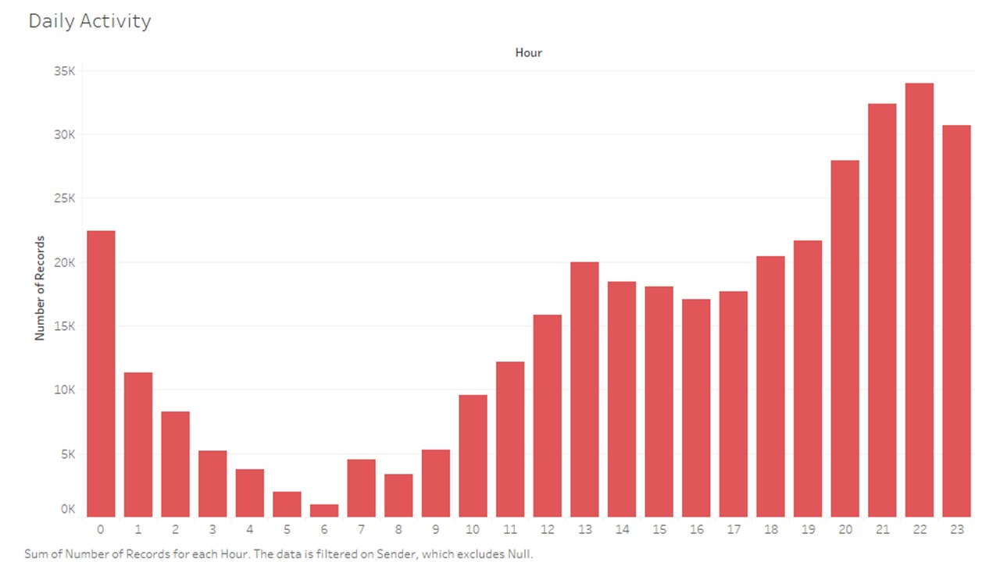

I downloaded my data from Facebook in a .json format. I used Python with Jupyter Notebook to play with data.

The json and pandas libraries are very useful to read and display data in a stylized way.

I added some columns to the data such as date (since the available time was a millisecond timestamp) and total characters for each row (each row represents a sent message).

Finally, I exported the data as an .xls file and opened it with Tableau to make the graphs.


```python
# data time range : 2010-10-24 to 2019-07-05
```


```python
# Imports

import json
import datetime
import matplotlib.pyplot as plt
import seaborn as sns
import pandas as pd
import numpy as np
import operator
```


```python
fileName = 'message_1.json'
orderedDays = ['Monday', 'Tuesday', 'Wednesday', 'Thursday', 'Friday', 'Saturday', 'Sunday']
```


```python
with open(fileName) as jsonFile:  
    data = json.load(jsonFile)
    dataList = []
    words = {}
    for index, message in enumerate(data['messages']):
        row = []
        row.append('Me' if message["sender_name"] == 'Mokhles Bouzaien' else 'Her')
        row.append(message['timestamp_ms'])
        try:
            row.append(message['content'])
        except KeyError:
            row.append(None)
            
        try:
            wordList = message["content"].split()
        except KeyError:
            pass
            
        for word in wordList:
            try:
                words[word] += 1
            except KeyError:
                words[word] = 1
                
        dataList.append(row)
dataList = np.array(dataList)
df = pd.DataFrame(dataList,columns=['sender', 'timestamp_ms', 'content'])
df['date'] = df.apply(lambda row: datetime.date.fromtimestamp(row.timestamp_ms / 1000), axis = 1)
df['year'] = df.apply(lambda row: datetime.date.fromtimestamp(row.timestamp_ms / 1000).year, axis = 1)
df['month'] = df.apply(lambda row: datetime.date.fromtimestamp(row.timestamp_ms / 1000).month, axis = 1)
df['day'] = df.apply(lambda row: datetime.date.fromtimestamp(row.timestamp_ms / 1000).day, axis = 1)
df['weekday'] = df.apply(lambda row: datetime.date.fromtimestamp(row.timestamp_ms / 1000).strftime('%A'), axis = 1)
df['hour'] = df.apply(lambda row: datetime.datetime.fromtimestamp(row.timestamp_ms / 1000).hour, axis = 1)
df['caracters'] = df.apply(lambda row: len(row.content) if row.content != None else 0, axis = 1)
df.head()
```


<div>
<style scoped>
    .dataframe tbody tr th:only-of-type {
        vertical-align: middle;
    }

    .dataframe tbody tr th {
        vertical-align: top;
    }

    .dataframe thead th {
        text-align: right;
    }
</style>
<table border="1" class="dataframe">
  <thead>
    <tr style="text-align: right;">
      <th></th>
      <th>sender</th>
      <th>timestamp_ms</th>
      <th>content</th>
      <th>date</th>
      <th>year</th>
      <th>month</th>
      <th>day</th>
      <th>weekday</th>
      <th>hour</th>
      <th>caracters</th>
    </tr>
  </thead>
  <tbody>
    <tr>
      <th>0</th>
      <td>Her</td>
      <td>1562350465800</td>
      <td>Hidden Message</td>
      <td>2019-07-05</td>
      <td>2019</td>
      <td>7</td>
      <td>5</td>
      <td>Friday</td>
      <td>20</td>
      <td>51</td>
    </tr>
    <tr>
      <th>1</th>
      <td>Her</td>
      <td>1562350430104</td>
      <td>Hidden Message</td>
      <td>2019-07-05</td>
      <td>2019</td>
      <td>7</td>
      <td>5</td>
      <td>Friday</td>
      <td>20</td>
      <td>33</td>
    </tr>
    <tr>
      <th>2</th>
      <td>Her</td>
      <td>1562350413998</td>
      <td>Hidden Message</td>
      <td>2019-07-05</td>
      <td>2019</td>
      <td>7</td>
      <td>5</td>
      <td>Friday</td>
      <td>20</td>
      <td>43</td>
    </tr>
    <tr>
      <th>3</th>
      <td>Me</td>
      <td>1562350377019</td>
      <td>Hidden Message</td>
      <td>2019-07-05</td>
      <td>2019</td>
      <td>7</td>
      <td>5</td>
      <td>Friday</td>
      <td>20</td>
      <td>12</td>
    </tr>
    <tr>
      <th>4</th>
      <td>Me</td>
      <td>1562350371595</td>
      <td>Hidden Message</td>
      <td>2019-07-05</td>
      <td>2019</td>
      <td>7</td>
      <td>5</td>
      <td>Friday</td>
      <td>20</td>
      <td>8</td>
    </tr>
  </tbody>
</table>
</div>


```python
# Data is exported as .slsx file and imported to Tableau
df.to_excel("output.xlsx", engine='xlsxwriter')
```


```python
sortedWords = sorted(words.items(), key=operator.itemgetter(1), reverse=True)
```


```python
# group data by sender
dfBySender = df.groupby('sender')['caracters'].agg(['sum', 'count'])
# dfBySender = pd.DataFrame(dfBySender).reset_index()
dfBySender.head()
```


<div>
<style scoped>
    .dataframe tbody tr th:only-of-type {
        vertical-align: middle;
    }

    .dataframe tbody tr th {
        vertical-align: top;
    }

    .dataframe thead th {
        text-align: right;
    }
</style>
<table border="1" class="dataframe">
  <thead>
    <tr style="text-align: right;">
      <th></th>
      <th>sum</th>
      <th>count</th>
    </tr>
    <tr>
      <th>sender</th>
      <th></th>
      <th></th>
    </tr>
  </thead>
  <tbody>
    <tr>
      <th>Her</th>
      <td>6351619</td>
      <td>210679</td>
    </tr>
    <tr>
      <th>Me</th>
      <td>2953745</td>
      <td>152407</td>
    </tr>
  </tbody>
</table>
</div>


```python
# dfBySender.plot.pie(y='count', figsize=(5, 5))
```


```python
# group data by date
dfByDate = df.groupby('date')['caracters'].agg(['sum', 'count'])
dfByDate.head()
```


<div>
<style scoped>
    .dataframe tbody tr th:only-of-type {
        vertical-align: middle;
    }

    .dataframe tbody tr th {
        vertical-align: top;
    }

    .dataframe thead th {
        text-align: right;
    }
</style>
<table border="1" class="dataframe">
  <thead>
    <tr style="text-align: right;">
      <th></th>
      <th>sum</th>
      <th>count</th>
    </tr>
    <tr>
      <th>date</th>
      <th></th>
      <th></th>
    </tr>
  </thead>
  <tbody>
    <tr>
      <th>2010-10-24</th>
      <td>43</td>
      <td>2</td>
    </tr>
    <tr>
      <th>2010-10-26</th>
      <td>9</td>
      <td>1</td>
    </tr>
    <tr>
      <th>2010-10-27</th>
      <td>13</td>
      <td>1</td>
    </tr>
    <tr>
      <th>2010-12-17</th>
      <td>19</td>
      <td>1</td>
    </tr>
    <tr>
      <th>2011-03-31</th>
      <td>16</td>
      <td>5</td>
    </tr>
  </tbody>
</table>
</div>


```python
print(dfByDate.loc[dfByDate['sum'].idxmax()])
print(dfByDate.loc[dfByDate['count'].idxmax()])
print(dfByDate['sum'].mean())
print(dfByDate['count'].mean())
```

    sum      36354
    count      346
    Name: 2012-07-23, dtype: int64
    sum      22975
    count     1171
    Name: 2018-08-20, dtype: int64
    3553.0217640320734
    138.63535700649103


```python
# plt.figure(figsize=(16,12))
# dfByDate['sum'].plot()
# plt.figure(figsize=(16,12))
# dfByDate['count'].plot()
# plt.figure(figsize=(16,6))
# plt.subplot(121)
# dfByDate.cumsum()['sum'].plot()
# plt.subplot(122)
# dfByDate.cumsum()['count'].plot()
```


```python
# group data by month
dfByMonth = df.groupby(['year','month'])['caracters'].agg(['sum', 'count'])
dfByMonth = dfByMonth.reset_index()
dfByMonth.head()
```


<div>
<style scoped>
    .dataframe tbody tr th:only-of-type {
        vertical-align: middle;
    }

    .dataframe tbody tr th {
        vertical-align: top;
    }

    .dataframe thead th {
        text-align: right;
    }
</style>
<table border="1" class="dataframe">
  <thead>
    <tr style="text-align: right;">
      <th></th>
      <th>year</th>
      <th>month</th>
      <th>sum</th>
      <th>count</th>
    </tr>
  </thead>
  <tbody>
    <tr>
      <th>0</th>
      <td>2010</td>
      <td>10</td>
      <td>65</td>
      <td>4</td>
    </tr>
    <tr>
      <th>1</th>
      <td>2010</td>
      <td>12</td>
      <td>19</td>
      <td>1</td>
    </tr>
    <tr>
      <th>2</th>
      <td>2011</td>
      <td>3</td>
      <td>16</td>
      <td>5</td>
    </tr>
    <tr>
      <th>3</th>
      <td>2011</td>
      <td>7</td>
      <td>2039</td>
      <td>154</td>
    </tr>
    <tr>
      <th>4</th>
      <td>2011</td>
      <td>8</td>
      <td>177</td>
      <td>22</td>
    </tr>
  </tbody>
</table>
</div>


```python
# sns.set()
# caracters = dfByMonth.pivot("month", "year", "sum")
# messages = dfByMonth.pivot("month", "year", "count")
# f, ax = plt.subplots(figsize=(16, 12))
# sns.heatmap(caracters, annot=False, ax=ax, cmap='YlGnBu')
# f, ax = plt.subplots(figsize=(16, 12))
# sns.heatmap(messages, annot=False, ax=ax, cmap='YlGnBu')
```


```python
# group data by year
dfByYear = df.groupby('year')['caracters'].agg(['sum', 'count'])
dfByYear = pd.DataFrame(dfByYear).reset_index()
dfByYear.head()
```


<div>
<style scoped>
    .dataframe tbody tr th:only-of-type {
        vertical-align: middle;
    }

    .dataframe tbody tr th {
        vertical-align: top;
    }

    .dataframe thead th {
        text-align: right;
    }
</style>
<table border="1" class="dataframe">
  <thead>
    <tr style="text-align: right;">
      <th></th>
      <th>year</th>
      <th>sum</th>
      <th>count</th>
    </tr>
  </thead>
  <tbody>
    <tr>
      <th>0</th>
      <td>2010</td>
      <td>84</td>
      <td>5</td>
    </tr>
    <tr>
      <th>1</th>
      <td>2011</td>
      <td>180787</td>
      <td>6445</td>
    </tr>
    <tr>
      <th>2</th>
      <td>2012</td>
      <td>1976590</td>
      <td>53485</td>
    </tr>
    <tr>
      <th>3</th>
      <td>2013</td>
      <td>817978</td>
      <td>26960</td>
    </tr>
    <tr>
      <th>4</th>
      <td>2014</td>
      <td>698706</td>
      <td>22401</td>
    </tr>
  </tbody>
</table>
</div>


```python
# group data by weekday
dfByWeekday = df.groupby('weekday')['caracters'].agg(['sum', 'count'])
dfByWeekday = dfByWeekday.reindex(orderedDays)
dfByWeekday = dfByWeekday.reset_index()
dfByWeekday
```


<div>
<style scoped>
    .dataframe tbody tr th:only-of-type {
        vertical-align: middle;
    }

    .dataframe tbody tr th {
        vertical-align: top;
    }

    .dataframe thead th {
        text-align: right;
    }
</style>
<table border="1" class="dataframe">
  <thead>
    <tr style="text-align: right;">
      <th></th>
      <th>weekday</th>
      <th>sum</th>
      <th>count</th>
    </tr>
  </thead>
  <tbody>
    <tr>
      <th>0</th>
      <td>Monday</td>
      <td>1383277</td>
      <td>52854</td>
    </tr>
    <tr>
      <th>1</th>
      <td>Tuesday</td>
      <td>1269405</td>
      <td>50000</td>
    </tr>
    <tr>
      <th>2</th>
      <td>Wednesday</td>
      <td>1248049</td>
      <td>48457</td>
    </tr>
    <tr>
      <th>3</th>
      <td>Thursday</td>
      <td>1179119</td>
      <td>46607</td>
    </tr>
    <tr>
      <th>4</th>
      <td>Friday</td>
      <td>1387426</td>
      <td>54655</td>
    </tr>
    <tr>
      <th>5</th>
      <td>Saturday</td>
      <td>1237290</td>
      <td>49303</td>
    </tr>
    <tr>
      <th>6</th>
      <td>Sunday</td>
      <td>1600798</td>
      <td>61210</td>
    </tr>
  </tbody>
</table>
</div>


```python
# # group data by date and weekday
# dfByDateWeekday = df.groupby(['date', 'weekday'])['caracters'].agg(['sum', 'count'])
# dfByDateWeekday = dfByDateWeekday.reset_index()
# dfByDateWeekday.head()
```


```python
# sns.catplot(x="weekday", y="count", order=orderedDays, data=dfByDateWeekday, height=12)
```


```python
# sns.catplot(x="weekday", y="count", order=orderedDays, kind='bar', data=dfByWeekday, height=12)
```


```python
# sns.boxplot(x="weekday", y="count", data=dfByDateWeekday)
```


```python
# group data by hour
dfByHour = df.groupby('hour')['caracters'].agg(['sum', 'count'])
dfByHour = dfByHour.reset_index()
dfByHour.head()
```


<div>
<style scoped>
    .dataframe tbody tr th:only-of-type {
        vertical-align: middle;
    }

    .dataframe tbody tr th {
        vertical-align: top;
    }

    .dataframe thead th {
        text-align: right;
    }
</style>
<table border="1" class="dataframe">
  <thead>
    <tr style="text-align: right;">
      <th></th>
      <th>hour</th>
      <th>sum</th>
      <th>count</th>
    </tr>
  </thead>
  <tbody>
    <tr>
      <th>0</th>
      <td>0</td>
      <td>629842</td>
      <td>26814</td>
    </tr>
    <tr>
      <th>1</th>
      <td>1</td>
      <td>410867</td>
      <td>17451</td>
    </tr>
    <tr>
      <th>2</th>
      <td>2</td>
      <td>239291</td>
      <td>9799</td>
    </tr>
    <tr>
      <th>3</th>
      <td>3</td>
      <td>176846</td>
      <td>7712</td>
    </tr>
    <tr>
      <th>4</th>
      <td>4</td>
      <td>123076</td>
      <td>5105</td>
    </tr>
  </tbody>
</table>
</div>


```python
# dfByHour['count'].plot.bar()
```



Reddit Post: https://www.reddit.com/r/dataisbeautiful/comments/caa9il/more_than_8_years_of_messages_between_my/
