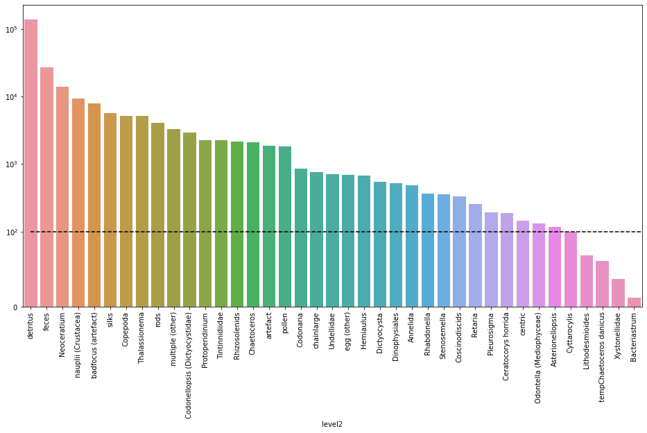
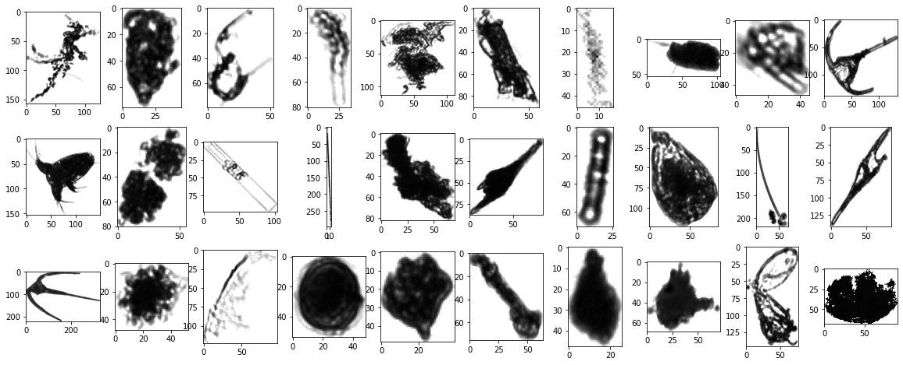
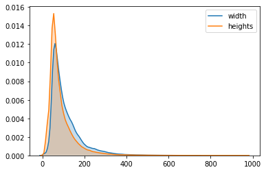
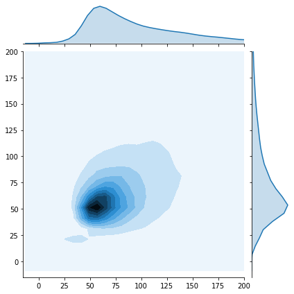
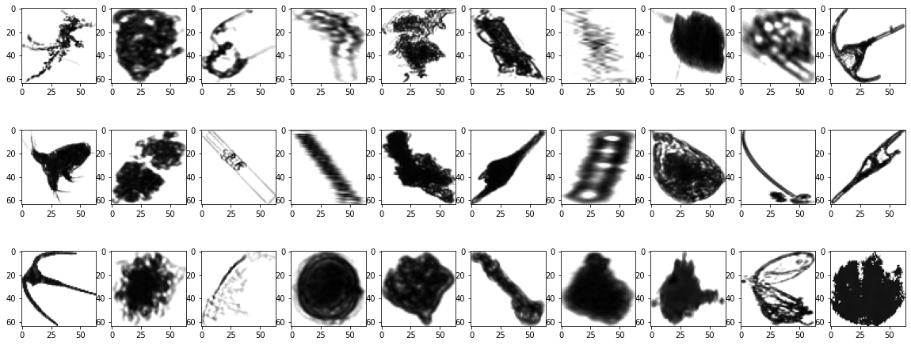
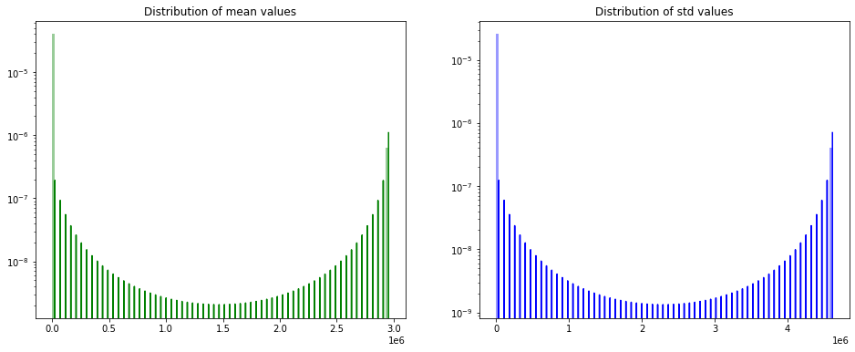
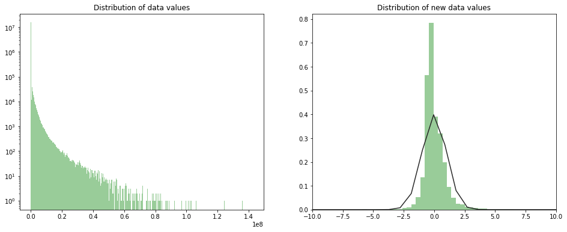
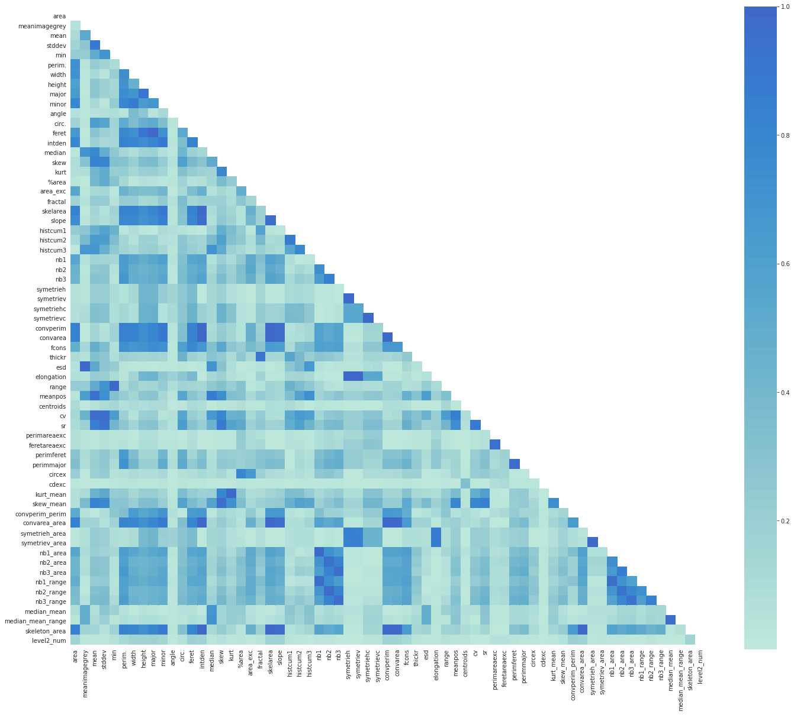
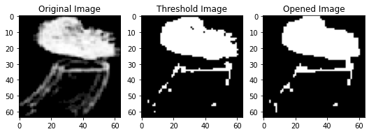
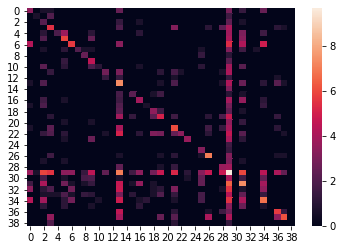

# Table of contents
1. [Introduction](#Introduction)
2. [Image Data Preparation](#Image-Data-Preparation)
    1. [Data Exploration](#Data-Exploration)
        1. [Class Distribution](#Class-Distribution)
        2. [Size Distribution](#Size-Distribution)
    2. [Data Preprocessing](#Data-Preprocessing)
    3. [Data Augmentation](#Data-Augmentation)
3. [Numerical Data Preparation](#Numerical-Data-Preparation)
    1. [Normalization](#Normalization)
    2. [Correlation](#Correlation)
    3. [Missing Data](#Missing-Data)
    4. [Dataholders](#Dataholders)
4. [Models](#Models)
    1. [Model for Images](#Model-for-Images)
    2. [Model for Numerical Data](#Model-for-Numerical-Data)
5. [Conclusion](#Conclusion)

# Introduction <a name="Introduction"></a>

The goal of this challenge is to provide solid approaches to plankton image classification. The notebook is structured in such a way as to explore different tasks, including but not limited to data preparation and model selection.

In the first part, we will work directly with provided images after applying some preprocessing tasks. And then, we will work with the extracted features provided in the features_native file.

# Image Data Preparation <a name="Data-Preparation"></a>

The data set we will be using is composed of ~240K gray scale plankton images that were acquired in the bay of Villefranche and manually engineered features that were computed on each imaged object.

## Data Exploration <a name="Data-Exploration"></a>

First, let's import the data set, have a look at the different available labels and the distribution of images among these classes.

This step is important in order to check wether our data set is imbalanced or not, and then choose the best evaluation metrics, e.g. if a data set is highly imbalanced, evaluating using the confusion matrix is more adapted than an overall accuracy.


```python
img_files = utils.extract_zip_to_memory("/content/drive/My Drive/flowcam/imgs.zip")
np_ids, np_data = zip(*sorted(img_files.items()))
del img_files
np_ids, np_data = list(map(lambda s: int(''.join(filter(str.isdigit, s))), np_ids)), list(map(lambda img: np.array(Image.open(img)), np_data))
del np_ids
```

Since, we are dealing with a quiet big dataset of images, every time we will try to manage the memory by deleting unused variables.


```python
meta_df = pd.read_csv("/content/drive/My Drive/flowcam/meta.csv")
sorted_level2 = meta_df.groupby('level2').size().sort_values(ascending=False)
sorted_level2.head()
```


    level2
    detritus               138439
    feces                   26936
    Neoceratium             14014
    nauplii (Crustacea)      9293
    badfocus (artefact)      7848
    dtype: int64


### Class Distribution <a name="Class-Distribution"></a>

The next plot shows how many images are available for each class in a descending order.

Note: A linear scale is used between $0$ and $100$ occurences in order to clearly visualize classes with few occurences. And a log scale is used for occurences above $100$ since values can reach $10^5$ for the detritus class.


```python
fog, ax = plt.subplots(figsize=(16, 8))
y_thresh = 1e2
ax.set_yscale('symlog', linthreshy=y_thresh)
ax.hlines(y=y_thresh, xmin=0, xmax=39, linestyles='dashed')
ax.tick_params(axis='x', labelrotation=90)
sns.barplot(x=sorted_level2.index, y=sorted_level2.values, ax=ax)
```


    <matplotlib.axes._subplots.AxesSubplot at 0x7fb4d22fce48>





We can clearly see that we have an imbalanced data set. Working with such a distrubution will have a negative impact classifying images from under represented classes such as Bacteriastrum ($12$ samples), Xystonellidae ($37$ samples), etc. because the model won't be able to lean much about those classes.

One solution for this problem is to use data augmentation. This approach will be discussed later.

### Size Distribution <a name="Size-Distribution"></a>

Now, we will focus on shapes of images. This is an important feature since we are working with an image data set because it will have a direct impact on the training process, e.g, performance and training time.

Let's start by randomly displaying $30$ images picked from the data set.


```python
utils.plot(data=np_data, seed=5)
```





We can see that the images have different shapes. We are going to have a closer look on the distribusion of images' dimesions.


```python
widths, heights = zip(*map(lambda x:x.shape, np_data))
```


```python
sns.kdeplot(list(widths), label='width', shade=True)
sns.kdeplot(list(heights), label='heights', shade=True)

g2 = sns.jointplot(x=widths, 
                    y=heights, 
                    kind="kde", 
                    xlim=(-15,200),
                    ylim=(-15,200))
```








```python
del widths
del heights
```

The KDE plot is used to have a global view on the distribution of the shapes. We can see that the images have very different shapes that vary from few pixels up to about $1000$ pixels. 

The joint plot was a good way to have a closer look on the distribusion of images' dimesions that are between $0$ and $200$ pixels. That helps us to choose the resizing value to be used.

We decided to rescale all images to 64x64x1 pixels for three main reasons:
* We will be using a convolutional neural network so all input samples should have the same size.
* As we can see in the joint plot, the shape distribution is concentrated around this value so we don't have much processing to do.
* This value is not too small so we keep important information, and not too big so training process is much faster.

Note: Resizing the images is based on a a bicubic interpolation over 4x4 pixel neighborhood method already implemented in OpenCV.

## Data Preprocessing <a name="Data-Preprocessing"></a>

Now, let's apply the reshaping function to all the images available in our data set. Then, we will show the same images after reshaping.


```python
np_reshaped_data = list(map(lambda img : utils.reshape(img, 64), np_data))

del np_data
```


```python
utils.plot(data=np_reshaped_data, seed=5)
```





```python
np_reshaped_data = np.expand_dims(np.asarray(np_reshaped_data) / 255.0, axis=3)
```

Finally, we convert data to a NumPy array and scale all pixel intensities to the range [0, 1]. This will help speeding up gradient convergence during the training step.

A neural network cannot operate on label data directly. It requires all input variables and output variables to be numeric. That's why we perform integer encoding for the data labels which transforms categorical data into numerical fields.


```python
labelencoder = LabelEncoder()
meta_df["level2_label"] = labelencoder.fit_transform(meta_df["level2"].astype(str))
#np_y = meta_df.sort_values(by=['objid'])[['objid', 'level2_label']].astype(int).values[:,1]
meta_df=meta_df.sort_values('objid')
cat_targets = pd.factorize(meta_df['level2'])[0]+1 ## We want targets  to start from 0
hot_targets = pd.get_dummies(cat_targets)
np_y=hot_targets
```


```python
print("Input shape:", np_reshaped_data.shape)
print("Target shape:", np_y.shape)
```

    Input shape: (243610, 64, 64, 1)
    Target shape: (243610, 40)


## Data Augmentation <a name="Data-Augmentation"></a>

One of the solutions to solve the problem of imblanced data distribution through the different classes is to perform data augmentation which consists of creating new data samples from the original ones by applying random perturbations to increase the size of the data set. Various transformation can be used such as rotation, translation, rescaling, flipping, etc.

We are going to use on-the-fly data augmentation using ImageDataGenerator class provided by Keras. That means this augmentation will be done at the training time.

# Numerical Data Preparation <a name="Numerical-Data-Preparation"></a>

In this part, we will deal with numerical features extracted from images. So a whole set of preprocessing tasks well be discussed in the next few steps.

Let's start by importing our data available in the features_native file, join meta data and features on objid and print an overview of the data set.


```python
meta_df = pd.read_csv("/content/drive/My Drive/flowcam/meta.csv")
features_df = pd.read_csv("/content/drive/My Drive/flowcam/features_native.csv")

labelencoder = LabelEncoder()
meta_df["level2_num"] = labelencoder.fit_transform(meta_df["level2"].astype(str))

meta_df.columns
```


    Index(['objid', 'projid', 'id', 'status', 'latitude', 'longitude', 'objdate',
           'objtime', 'depth_min', 'depth_max', 'unique_name', 'lineage', 'level1',
           'level2', 'level2_num'],
          dtype='object')


```python
data_df = features_df.join(meta_df[["objid", "level2_num"]].set_index('objid'), on='objid').drop(["objid"], axis=1)
data_df.describe()
```


<div>
<style scoped>
    .dataframe tbody tr th:only-of-type {
        vertical-align: middle;
    }

    .dataframe tbody tr th {
        vertical-align: top;
    }

    .dataframe thead th {
        text-align: right;
    }
</style>
<table border="1" class="dataframe">
  <thead>
    <tr style="text-align: right;">
      <th></th>
      <th>area</th>
      <th>meanimagegrey</th>
      <th>mean</th>
      <th>stddev</th>
      <th>min</th>
      <th>perim.</th>
      <th>width</th>
      <th>height</th>
      <th>major</th>
      <th>minor</th>
      <th>angle</th>
      <th>circ.</th>
      <th>feret</th>
      <th>intden</th>
      <th>median</th>
      <th>skew</th>
      <th>kurt</th>
      <th>%area</th>
      <th>area_exc</th>
      <th>fractal</th>
      <th>skelarea</th>
      <th>slope</th>
      <th>histcum1</th>
      <th>histcum2</th>
      <th>histcum3</th>
      <th>nb1</th>
      <th>nb2</th>
      <th>nb3</th>
      <th>symetrieh</th>
      <th>symetriev</th>
      <th>symetriehc</th>
      <th>symetrievc</th>
      <th>convperim</th>
      <th>convarea</th>
      <th>fcons</th>
      <th>thickr</th>
      <th>esd</th>
      <th>elongation</th>
      <th>range</th>
      <th>meanpos</th>
      <th>centroids</th>
      <th>cv</th>
      <th>sr</th>
      <th>perimareaexc</th>
      <th>feretareaexc</th>
      <th>perimferet</th>
      <th>perimmajor</th>
      <th>circex</th>
      <th>cdexc</th>
      <th>kurt_mean</th>
      <th>skew_mean</th>
      <th>convperim_perim</th>
      <th>convarea_area</th>
      <th>symetrieh_area</th>
      <th>symetriev_area</th>
      <th>nb1_area</th>
      <th>nb2_area</th>
      <th>nb3_area</th>
      <th>nb1_range</th>
      <th>nb2_range</th>
      <th>nb3_range</th>
      <th>median_mean</th>
      <th>median_mean_range</th>
      <th>skeleton_area</th>
      <th>level2_num</th>
    </tr>
  </thead>
  <tbody>
    <tr>
      <th>count</th>
      <td>243610.000000</td>
      <td>243610.000000</td>
      <td>243610.000000</td>
      <td>243610.000000</td>
      <td>243610.000000</td>
      <td>243610.000000</td>
      <td>243610.000000</td>
      <td>243610.000000</td>
      <td>243610.000000</td>
      <td>243610.000000</td>
      <td>243610.000000</td>
      <td>243610.000000</td>
      <td>243610.000000</td>
      <td>2.436100e+05</td>
      <td>243610.000000</td>
      <td>243610.000000</td>
      <td>243610.000000</td>
      <td>243610.00000</td>
      <td>243610.000000</td>
      <td>243610.000000</td>
      <td>243610.000000</td>
      <td>243610.000000</td>
      <td>243610.000000</td>
      <td>243610.000000</td>
      <td>243610.000000</td>
      <td>243610.000000</td>
      <td>243610.000000</td>
      <td>243610.000000</td>
      <td>243610.000000</td>
      <td>243610.000000</td>
      <td>243610.000000</td>
      <td>243610.000000</td>
      <td>243610.000000</td>
      <td>243610.000000</td>
      <td>243610.000000</td>
      <td>243610.000000</td>
      <td>243610.000000</td>
      <td>243610.000000</td>
      <td>243610.000000</td>
      <td>243610.000000</td>
      <td>243610.000000</td>
      <td>243610.000000</td>
      <td>243610.000000</td>
      <td>209182.000000</td>
      <td>209182.000000</td>
      <td>243610.000000</td>
      <td>243610.000000</td>
      <td>243610.000000</td>
      <td>209182.000000</td>
      <td>243610.000000</td>
      <td>243610.000000</td>
      <td>243610.000000</td>
      <td>236756.000000</td>
      <td>236756.000000</td>
      <td>236756.000000</td>
      <td>236756.000000</td>
      <td>236756.000000</td>
      <td>236756.000000</td>
      <td>243610.000000</td>
      <td>243610.000000</td>
      <td>243610.000000</td>
      <td>243610.000000</td>
      <td>243610.000000</td>
      <td>236756.000000</td>
      <td>243610.000000</td>
    </tr>
    <tr>
      <th>mean</th>
      <td>3954.559123</td>
      <td>158.489675</td>
      <td>218.064412</td>
      <td>47.972455</td>
      <td>101.442461</td>
      <td>545.412294</td>
      <td>86.939268</td>
      <td>109.699889</td>
      <td>146.871391</td>
      <td>93.066144</td>
      <td>58.594023</td>
      <td>0.288874</td>
      <td>129.299752</td>
      <td>2.956125e+06</td>
      <td>240.964603</td>
      <td>-1.426133</td>
      <td>2.505907</td>
      <td>94.10801</td>
      <td>250.382858</td>
      <td>1.049611</td>
      <td>13209.067189</td>
      <td>0.963900</td>
      <td>165.681167</td>
      <td>199.331932</td>
      <td>234.226259</td>
      <td>5.390583</td>
      <td>5.633706</td>
      <td>5.227195</td>
      <td>1.737680</td>
      <td>1.735016</td>
      <td>5.155096</td>
      <td>5.224933</td>
      <td>13176.348832</td>
      <td>12898.915816</td>
      <td>163.106328</td>
      <td>1.346968</td>
      <td>99.874570</td>
      <td>1.762178</td>
      <td>153.557539</td>
      <td>-0.353172</td>
      <td>0.587303</td>
      <td>23.333286</td>
      <td>30.423929</td>
      <td>27.142845</td>
      <td>8.214832</td>
      <td>4.057089</td>
      <td>3.524483</td>
      <td>5.050091</td>
      <td>0.039956</td>
      <td>0.009251</td>
      <td>-0.005979</td>
      <td>21.187097</td>
      <td>80.242329</td>
      <td>0.010013</td>
      <td>0.009981</td>
      <td>0.032841</td>
      <td>0.034550</td>
      <td>0.032731</td>
      <td>0.034816</td>
      <td>0.037358</td>
      <td>0.035254</td>
      <td>22.892997</td>
      <td>0.148051</td>
      <td>82.210980</td>
      <td>27.891490</td>
    </tr>
    <tr>
      <th>std</th>
      <td>5478.161193</td>
      <td>27.586551</td>
      <td>25.088674</td>
      <td>19.143144</td>
      <td>31.879623</td>
      <td>515.927925</td>
      <td>62.118882</td>
      <td>71.819207</td>
      <td>86.093936</td>
      <td>54.321102</td>
      <td>42.897670</td>
      <td>0.242218</td>
      <td>80.530219</td>
      <td>4.617139e+06</td>
      <td>34.366794</td>
      <td>1.268486</td>
      <td>10.055730</td>
      <td>8.60842</td>
      <td>801.190148</td>
      <td>0.077987</td>
      <td>20146.988677</td>
      <td>1.925124</td>
      <td>56.143371</td>
      <td>51.353393</td>
      <td>32.497241</td>
      <td>6.747436</td>
      <td>8.012987</td>
      <td>8.909747</td>
      <td>0.772673</td>
      <td>0.769537</td>
      <td>5.844405</td>
      <td>5.845856</td>
      <td>20151.658603</td>
      <td>20241.016241</td>
      <td>159.922600</td>
      <td>0.886610</td>
      <td>17.413678</td>
      <td>1.242256</td>
      <td>31.879623</td>
      <td>0.317733</td>
      <td>3.907660</td>
      <td>11.959699</td>
      <td>9.562527</td>
      <td>77.942987</td>
      <td>25.223842</td>
      <td>1.652132</td>
      <td>1.508469</td>
      <td>10.997803</td>
      <td>0.708402</td>
      <td>0.040341</td>
      <td>0.005418</td>
      <td>9.512411</td>
      <td>129.959197</td>
      <td>0.006027</td>
      <td>0.006015</td>
      <td>0.042003</td>
      <td>0.051906</td>
      <td>0.057964</td>
      <td>0.042357</td>
      <td>0.052351</td>
      <td>0.058239</td>
      <td>21.784279</td>
      <td>0.126209</td>
      <td>129.380889</td>
      <td>7.226222</td>
    </tr>
    <tr>
      <th>min</th>
      <td>188.000000</td>
      <td>0.000000</td>
      <td>98.380000</td>
      <td>1.113000</td>
      <td>3.000000</td>
      <td>60.380000</td>
      <td>6.000000</td>
      <td>9.000000</td>
      <td>28.200000</td>
      <td>15.800000</td>
      <td>0.000000</td>
      <td>0.001000</td>
      <td>19.400000</td>
      <td>1.262460e+05</td>
      <td>67.000000</td>
      <td>-26.982000</td>
      <td>-1.964000</td>
      <td>13.44000</td>
      <td>0.000000</td>
      <td>0.970000</td>
      <td>555.000000</td>
      <td>0.000000</td>
      <td>0.000000</td>
      <td>0.000000</td>
      <td>67.000000</td>
      <td>0.000000</td>
      <td>0.000000</td>
      <td>0.000000</td>
      <td>1.144000</td>
      <td>1.154000</td>
      <td>0.000000</td>
      <td>0.000000</td>
      <td>508.000000</td>
      <td>380.000000</td>
      <td>0.000000</td>
      <td>1.001000</td>
      <td>0.000000</td>
      <td>1.000000</td>
      <td>7.000000</td>
      <td>-3.815789</td>
      <td>-45.000000</td>
      <td>0.392157</td>
      <td>1.834862</td>
      <td>0.016034</td>
      <td>0.004850</td>
      <td>2.034682</td>
      <td>1.622222</td>
      <td>0.000000</td>
      <td>-12.000000</td>
      <td>-0.015267</td>
      <td>-0.106299</td>
      <td>3.429603</td>
      <td>2.228070</td>
      <td>0.005747</td>
      <td>0.005747</td>
      <td>0.000000</td>
      <td>0.000000</td>
      <td>0.000000</td>
      <td>0.000000</td>
      <td>0.000000</td>
      <td>0.000000</td>
      <td>-73.000000</td>
      <td>-0.376344</td>
      <td>3.232558</td>
      <td>0.000000</td>
    </tr>
    <tr>
      <th>25%</th>
      <td>1646.000000</td>
      <td>157.300000</td>
      <td>202.770000</td>
      <td>34.032000</td>
      <td>83.000000</td>
      <td>252.050000</td>
      <td>50.000000</td>
      <td>62.000000</td>
      <td>86.900000</td>
      <td>60.900000</td>
      <td>0.000000</td>
      <td>0.092000</td>
      <td>73.400000</td>
      <td>9.247488e+05</td>
      <td>251.000000</td>
      <td>-2.047000</td>
      <td>-1.443000</td>
      <td>92.19000</td>
      <td>9.000000</td>
      <td>1.013000</td>
      <td>4444.000000</td>
      <td>0.186000</td>
      <td>118.000000</td>
      <td>159.000000</td>
      <td>233.000000</td>
      <td>1.000000</td>
      <td>1.000000</td>
      <td>1.000000</td>
      <td>1.435000</td>
      <td>1.435000</td>
      <td>2.000000</td>
      <td>2.000000</td>
      <td>4410.000000</td>
      <td>4092.000000</td>
      <td>24.663250</td>
      <td>1.007000</td>
      <td>98.000000</td>
      <td>1.142857</td>
      <td>141.000000</td>
      <td>-0.481481</td>
      <td>-1.000000</td>
      <td>14.345992</td>
      <td>22.929936</td>
      <td>2.047657</td>
      <td>0.472973</td>
      <td>2.975207</td>
      <td>2.500000</td>
      <td>0.299199</td>
      <td>-0.020202</td>
      <td>-0.005102</td>
      <td>-0.008547</td>
      <td>15.809914</td>
      <td>25.071429</td>
      <td>0.006061</td>
      <td>0.006024</td>
      <td>0.006410</td>
      <td>0.006173</td>
      <td>0.006024</td>
      <td>0.009091</td>
      <td>0.006623</td>
      <td>0.006135</td>
      <td>12.000000</td>
      <td>0.083333</td>
      <td>27.357576</td>
      <td>30.000000</td>
    </tr>
    <tr>
      <th>50%</th>
      <td>2435.000000</td>
      <td>165.310000</td>
      <td>222.460000</td>
      <td>49.484000</td>
      <td>97.000000</td>
      <td>395.400000</td>
      <td>67.000000</td>
      <td>87.000000</td>
      <td>120.700000</td>
      <td>76.700000</td>
      <td>90.000000</td>
      <td>0.204000</td>
      <td>104.800000</td>
      <td>1.565890e+06</td>
      <td>254.000000</td>
      <td>-1.198000</td>
      <td>-0.177000</td>
      <td>97.64000</td>
      <td>61.000000</td>
      <td>1.020000</td>
      <td>7189.000000</td>
      <td>0.393000</td>
      <td>156.000000</td>
      <td>215.000000</td>
      <td>249.000000</td>
      <td>4.000000</td>
      <td>3.000000</td>
      <td>2.000000</td>
      <td>1.490000</td>
      <td>1.489000</td>
      <td>3.000000</td>
      <td>3.000000</td>
      <td>7155.500000</td>
      <td>6970.000000</td>
      <td>118.620500</td>
      <td>1.010000</td>
      <td>104.000000</td>
      <td>1.370968</td>
      <td>158.000000</td>
      <td>-0.263566</td>
      <td>0.000000</td>
      <td>22.321429</td>
      <td>31.818182</td>
      <td>5.106039</td>
      <td>1.215686</td>
      <td>3.607143</td>
      <td>3.106222</td>
      <td>1.795196</td>
      <td>0.000000</td>
      <td>0.000000</td>
      <td>-0.004785</td>
      <td>19.482353</td>
      <td>42.975294</td>
      <td>0.006536</td>
      <td>0.006494</td>
      <td>0.023952</td>
      <td>0.018987</td>
      <td>0.012739</td>
      <td>0.024096</td>
      <td>0.020979</td>
      <td>0.014388</td>
      <td>24.000000</td>
      <td>0.156977</td>
      <td>44.311377</td>
      <td>30.000000</td>
    </tr>
    <tr>
      <th>75%</th>
      <td>3953.000000</td>
      <td>166.920000</td>
      <td>237.860000</td>
      <td>62.801000</td>
      <td>114.000000</td>
      <td>636.147500</td>
      <td>104.000000</td>
      <td>135.000000</td>
      <td>178.300000</td>
      <td>108.300000</td>
      <td>90.000000</td>
      <td>0.434000</td>
      <td>159.300000</td>
      <td>3.117444e+06</td>
      <td>255.000000</td>
      <td>-0.555000</td>
      <td>3.104000</td>
      <td>99.67000</td>
      <td>213.000000</td>
      <td>1.025000</td>
      <td>13824.000000</td>
      <td>0.955000</td>
      <td>219.000000</td>
      <td>248.000000</td>
      <td>252.000000</td>
      <td>7.000000</td>
      <td>7.000000</td>
      <td>6.000000</td>
      <td>1.686000</td>
      <td>1.682000</td>
      <td>6.000000</td>
      <td>6.000000</td>
      <td>13800.000000</td>
      <td>13653.000000</td>
      <td>263.097250</td>
      <td>1.015000</td>
      <td>106.000000</td>
      <td>1.827160</td>
      <td>172.000000</td>
      <td>-0.131034</td>
      <td>4.000000</td>
      <td>30.927835</td>
      <td>38.690476</td>
      <td>15.687500</td>
      <td>4.139884</td>
      <td>4.725352</td>
      <td>4.125495</td>
      <td>5.229442</td>
      <td>0.035714</td>
      <td>0.012712</td>
      <td>-0.004348</td>
      <td>24.116485</td>
      <td>84.197605</td>
      <td>0.012121</td>
      <td>0.012121</td>
      <td>0.042169</td>
      <td>0.042683</td>
      <td>0.036364</td>
      <td>0.045198</td>
      <td>0.047619</td>
      <td>0.040462</td>
      <td>38.000000</td>
      <td>0.237569</td>
      <td>85.337580</td>
      <td>30.000000</td>
    </tr>
    <tr>
      <th>max</th>
      <td>280773.000000</td>
      <td>174.550000</td>
      <td>254.560000</td>
      <td>93.311000</td>
      <td>248.000000</td>
      <td>21714.830000</td>
      <td>972.000000</td>
      <td>739.000000</td>
      <td>1105.800000</td>
      <td>796.600000</td>
      <td>90.000000</td>
      <td>0.931000</td>
      <td>1024.900000</td>
      <td>1.425062e+08</td>
      <td>255.000000</td>
      <td>2.175000</td>
      <td>919.038000</td>
      <td>100.00000</td>
      <td>123925.000000</td>
      <td>1.465000</td>
      <td>596160.000000</td>
      <td>73.458000</td>
      <td>253.000000</td>
      <td>253.000000</td>
      <td>255.000000</td>
      <td>158.000000</td>
      <td>225.000000</td>
      <td>343.000000</td>
      <td>21.911000</td>
      <td>21.852000</td>
      <td>138.000000</td>
      <td>138.000000</td>
      <td>596160.000000</td>
      <td>596160.000000</td>
      <td>1591.508000</td>
      <td>11.965000</td>
      <td>110.000000</td>
      <td>31.000000</td>
      <td>252.000000</td>
      <td>0.000000</td>
      <td>37.000000</td>
      <td>70.731707</td>
      <td>46.524064</td>
      <td>2083.000000</td>
      <td>755.000000</td>
      <td>55.114213</td>
      <td>57.447090</td>
      <td>784.527697</td>
      <td>20.000000</td>
      <td>3.618110</td>
      <td>0.020408</td>
      <td>184.949971</td>
      <td>5658.000000</td>
      <td>1.000000</td>
      <td>1.000000</td>
      <td>3.000000</td>
      <td>7.000000</td>
      <td>7.000000</td>
      <td>0.923977</td>
      <td>1.618705</td>
      <td>1.727941</td>
      <td>84.000000</td>
      <td>0.430769</td>
      <td>5658.000000</td>
      <td>39.000000</td>
    </tr>
  </tbody>
</table>
</div>


## Normalization <a name="Normalization"></a>

Similarly to working with images, normalizing the numerical features is an important step that will help speeding up gradient convergence during the training step.

So at the beginning, let's have a quick look at the distribution of means and std values for different features.

Note: we used a log scale for the y axis because values are scattered on a huge range.


```python
fig, (ax1, ax2) = plt.subplots(nrows=1, ncols=2, figsize=(16,6))
sns.distplot(data_df.mean(axis=0), color="green", kde=True, bins=120, ax=ax1)
sns.distplot(data_df.std(axis=0), color="blue", kde=True, bins=120, ax=ax2)

ax1.set_title('Distribution of mean values')
ax2.set_title('Distribution of std values')

ax1.set_yscale('log')
ax2.set_yscale('log')


plt.show()
```





We can notice that the mean and std values have a wide distribution range (up to 1e6).

We can think about normalizing data by substructing the mean and dividing by the std value of each column. This normalizing step is very important in order to avoid any scaling problem (e.g distances between points won't be dominated by features with high values) and also to speed up the training process (e.g. gradient descent will converge faster).

The new distribution of data values is shown is the next figure.

Note: we use the mean and the std of the training set to normalize in order to avoid introducing a bias in the data.


```python
from sklearn.model_selection import train_test_split
X_train_df, _, _, _ = train_test_split(data_df.drop(['level2_num'], axis=1), data_df['level2_num'], test_size=0.2, random_state=42)
```


```python
from scipy.stats import norm

features = X_train_df.columns
normalized_df = (X_train_df[features] - X_train_df[features].mean(axis=0)) / X_train_df[features].std(axis=0)

fig, (ax1, ax2) = plt.subplots(nrows=1, ncols=2, figsize=(16,6))
sns.distplot(data_df, kde=False, color="green", bins=500, ax=ax1)
sns.distplot(normalized_df, kde=False, color="green", bins=500, fit=norm, ax=ax2)

ax1.set_title('Distribution of data values')
ax2.set_title('Distribution of new data values')

ax1.set_yscale('log')
#ax2.set_yscale('log')
plt.xlim(-10,10)

plt.show()
```





## Correlation <a name="Correlation"></a>

As we can see we have so many features describing the data samples. Probably not all of these feature are importatnt to predict our target.

So now, we are going to keep only columns which are relevent to this problem.

So let's have a quick look to the correlation between different features using the correlation matrix.


```python
#correlation matrix
normalized_df['level2_num'] = data_df['level2_num']
corrmat = np.abs(normalized_df.corr())
mask = np.zeros_like(corrmat)
mask[np.triu_indices_from(mask)] = True
with sns.axes_style("white"):
    f, ax = plt.subplots(figsize=(24, 20))
    ax = sns.heatmap(corrmat, mask=mask, square=True, center=2)
```





This heatmap gave us a great overview of our data as well as the relationship between different features.

We notice that there are many darkblue-colored squares: there are obvious correlations such as between nbX, nbX_range and nbX_area.

These columns give almost the same information, so we can get rid of extra ones.


```python
# Select upper triangle of correlation matrix
upper = corrmat.where(np.triu(np.ones(corrmat.shape), k=1).astype(np.bool))

# Find index of feature columns with correlation greater than 0.95
to_drop = [column for column in upper.columns if any(upper[column] > 0.95)]
```

Here is the list of features to drop. As previously discussed it contains 'nb1_area', 'nb2_area', 'nb3_area', 'nb1_range', 'nb2_range' and 'nb3_range' which are correlated with nbX features.


```python
to_drop
```


    ['feret',
     'skelarea',
     'slope',
     'symetriev',
     'symetrievc',
     'convperim',
     'convarea',
     'esd',
     'elongation',
     'range',
     'cv',
     'perimmajor',
     'kurt_mean',
     'skew_mean',
     'convarea_area',
     'symetriev_area',
     'nb1_area',
     'nb2_area',
     'nb3_area',
     'nb1_range',
     'nb2_range',
     'nb3_range',
     'median_mean_range',
     'skeleton_area']


```python
new_normalized_df = normalized_df.drop(to_drop, axis=1)
```

## Missing Data <a name="Missing-Data"></a>


```python
# Missing Data
total = new_normalized_df.isnull().sum().sort_values(ascending=False)
percent = (new_normalized_df.isnull().sum()/new_normalized_df.isnull().count()).sort_values(ascending=False)
missing_data = pd.concat([total, percent], axis=1, keys=['Total', 'Percent'])
missing_data.head(5)
```


<div>
<style scoped>
    .dataframe tbody tr th:only-of-type {
        vertical-align: middle;
    }

    .dataframe tbody tr th {
        vertical-align: top;
    }

    .dataframe thead th {
        text-align: right;
    }
</style>
<table border="1" class="dataframe">
  <thead>
    <tr style="text-align: right;">
      <th></th>
      <th>Total</th>
      <th>Percent</th>
    </tr>
  </thead>
  <tbody>
    <tr>
      <th>cdexc</th>
      <td>27565</td>
      <td>0.141440</td>
    </tr>
    <tr>
      <th>feretareaexc</th>
      <td>27565</td>
      <td>0.141440</td>
    </tr>
    <tr>
      <th>perimareaexc</th>
      <td>27565</td>
      <td>0.141440</td>
    </tr>
    <tr>
      <th>symetrieh_area</th>
      <td>5392</td>
      <td>0.027667</td>
    </tr>
    <tr>
      <th>level2_num</th>
      <td>0</td>
      <td>0.000000</td>
    </tr>
  </tbody>
</table>
</div>


We notice that 4 different columns have missing data. Since our data set is quiet big, we can choose to drop all samples that have at least one missing value and that won't affect our results.


```python
new_normalized_df = new_normalized_df.dropna()
```

## Dataholders <a name="Dataholders"></a>

We split our data using the same random_state previously used in order to get the same training and testing set. Then, we use One-Hot Encoder to get numerical labels and finally convert our data to numpy arrays.

Now, our data is ready to be used to train the model!


```python
from sklearn.model_selection import train_test_split
X_train_df, X_test_df, y_train_df, y_test_df = train_test_split(new_normalized_df.drop(['level2_num'], axis=1), new_normalized_df['level2_num'], test_size=0.2, random_state=42)
```


```python
from sklearn.preprocessing import OneHotEncoder

onehot_encoder = OneHotEncoder(sparse=False)
integer_encoded = y_train_df.values.reshape(len(y_train_df.values), 1)
y_train = onehot_encoder.fit_transform(integer_encoded)

onehot_encoder = OneHotEncoder(sparse=False)
integer_encoded = y_test_df.values.reshape(len(y_test_df.values), 1)
y_test = onehot_encoder.fit_transform(integer_encoded)
```


```python
X_train, X_test = X_train_df.values, X_test_df.values
y_train, y_test = y_train_df.values, y_test_df.values
print("Features matrix shape:", X_train.shape)
print("Targets vector shape:", y_train.shape)
```

    Features matrix shape: (129596, 40)
    Targets vector shape: (129596,)


# Models <a name="Models"></a>

## Model for Images <a name="Model-for-Images"></a>


```python
meta_df = pd.read_csv("/content/drive/My Drive/flowacam/meta.csv")

cat_targets = pd.factorize(meta_df['level2'])[0]+1 ## We want targets  to start from 0
hot_targets = pd.get_dummies(cat_targets)
hot_targets = hot_targets.set_index(meta_df['objid'].astype(int))

## define constants
IMG_SIZE = (64,64)
NUM_IMG = cat_targets.size
BATCH_SIZE = 512
EPOCHS=25

```

### Data balancing

In the previous section we noticed that the data distribution with respect to classes is heavily skewed. If left unchanged our model would be more biased towards predicting classes with high cardinality.

If we were aiming sollely for accuracy this wouldn't matter as the **top 3 most occuring classes cover 70% of our data** and our model would do great just by predicting these classes.

But our metric is the F1 score which gives **equal importance** to all of the classes. Thus we need to find a way to balance our data during training.

We considerer using some data augmentation techniques  **ONLY** for the classes with low occurences, such as zooming, flipping ... but we couldn't find a time efficient way to do this.


Our workaround consisted of assigning **weights to each class**, such that the model is penalized more for missclassifying low cardinality classes.


```python
weights = compute_class_weight('balanced', np.unique(cat_targets), cat_targets)
class_weights = dict(zip(np.unique(cat_targets), weights))
```

Our input consist of 64x64 grayscale images. We will be using **Convolution Neural Networks** to make our predictions.

Usually CNNs work with RGB images wich have 3 different channels. Inspired by this idea, our input image will have **3 channels as well**. A channel for the normal **grayscale** image, one for the image passed through a **thresholing** filter. And one where we perform the morpholigical operation of **opening**. Opening should get rid of static around borders along with small artefacts whereas thresholding should make details clearer.

The intuition is that stacking these channels will give our model a clearer view of the object.


```python
sub1 = plt.subplot(1,4,1)
plt.imshow(imgrey, cmap=cm.gray_r)
sub1.set_title("Original Image")

sub2 = plt.subplot(1,4,2)
plt.imshow(imthr, cmap=cm.gray_r)
sub2.set_title("Threshold Image")

sub3 = plt.subplot(1,4,3)
plt.imshow(imclosed, cmap=cm.gray_r)
sub3.set_title("Opened Image")
```


    Text(0.5, 1.0, 'Opened Image')





Our dataset is too large to fit in memory.

To fix this problem we inherit the **DirectoryIterator** class.

This class allows us to fetch data from directory and feed it in real time to the model.

**Note :** We considered using the **flow_from_directory** function from Keras but this function required a specific structure of the training folder. It uses this structure to set the image labels.

To work our way around this we had to set the image attributes manually for each batch yielded by the generator.

We do this by overriding the **get_batches_of_transformed_samples** function.


We use the **ImageDataGenerator** class that allows us to perform data augmentation and preprocessing while reading from directory. And split our data into train and test set.

For our CNN architecture we chose an architecture similar to [LeNET](https://engmrk.com/lenet-5-a-classic-cnn-architecture/). 

With 3 Convd + Maxpool layers and 3 Fully connected layers.


We use google colab with GPU's for training.

Even with a relatively shallow network. Training time is of 4 minutes per epoch. 

**Note:** Colab runtimes stop after approx 1h limiting us to 20 epochs for training.


```python
LeNet = Sequential([
    Conv2D(6, (2, 2), activation='relu', input_shape=(IMG_SIZE[0], IMG_SIZE[1], 3)),
    MaxPooling2D(),
    Conv2D(16, (2, 2),activation='relu'),
    MaxPooling2D(),
    Conv2D(16, (2, 2),activation='relu'),
    MaxPooling2D(),
    Flatten(),
    Dense(250, activation='relu'),
    Dense(100, activation='relu'),
    Dense(40,activation='softmax')
])


opt=tf.keras.optimizers.Adam()

LeNet.compile(optimizer=opt, 
              loss='categorical_crossentropy', 
              metrics=['accuracy',tfa.metrics.F1Score(num_classes=40,average='macro')])

#LeNet.summary()
```

### Train The Model


```python
import warnings
warnings.filterwarnings("ignore")
train_ds=train_ds.prefetch(tf.data.experimental.AUTOTUNE)
LeNet.fit(train_gen, epochs=1,class_weight=class_weights,steps_per_epoch=190000/BATCH_SIZE)

```

    372/371 [==============================] - 225s 605ms/step - loss: 0.3235 - accuracy: 0.5294 - f1_score: 0.4571


    <tensorflow.python.keras.callbacks.History at 0x7f39b6f42908>


After 30 epochs our model reaches an accuracy of 50% and an F1 score of 30% on test set.

It is worth mentioning that if we choose **not to use use class weights** our model can reach an accuracy of 80% and an F1 score of 25%.


```python
loss, accuracy, F1_score = LeNet.evaluate_generator(test_gen)
print("Accuracy = ",accuracy, 'Loss = ',loss," Score = ",F1_score)
```

    Accuracy =  0.5482328534126282 Loss =  1.5674445629119873  Score =  0.3294264078140259


Having an image classification task at hand. One could re use **pre-trained** models on big datasets such as cifar 10.

Such operation is called transfer learning where we take a pre-trained model ( A VGG 19 in our case) and remove the Fully connected layers on top that serve for classification.

The idea is that in order to perform classifications on datasets as large as Cifar100, VGG19 learns a latent image representation in the level of it's intermediate layers. For example it can learn to find patters such wheels and other geometrical shapes.

**Training** : We freeze the first layers (which consist of convolutions) so that we dont have to retrain the whole model. Then we add some FC layers whose weights we'll be training for our task.

**NOTE :** One epoch requires approx 11 minutes for no major change in accuracy. Training such a model may require a high number of epochs and we didn't have the time to do so.

## Model for Numerical Data <a name="Model-for-Numerical-Data"></a>

Since our data set is inbalanced, we use sample weighting which means increasing the contribution of an example to the loss function.


```python
class_weights = list(class_weight.compute_class_weight('balanced',
                                             np.unique(y_train),
                                             y_train))

w_array = np.ones(y_train.shape[0], dtype = 'int')
for i, val in enumerate(y_train):
    w_array[i] = class_weights[val-1]

```


```python
xgb_model = xgb.XGBClassifier(objective="multi:softmax", 
                              num_class=40, 
                              random_state=42, 
                              tree_method='gpu_hist', 
                              gpu_id=0)
xgb_model.fit(X_train, y_train, sample_weight=w_array, verbose=True)
```


    XGBClassifier(base_score=0.5, booster='gbtree', colsample_bylevel=1,
                  colsample_bynode=1, colsample_bytree=1, eval_metric='auc',
                  gamma=0, gpu_id=0, learning_rate=0.1, max_delta_step=0,
                  max_depth=3, min_child_weight=1, missing=None, n_estimators=100,
                  n_jobs=1, nthread=None, num_class=40, objective='multi:softprob',
                  random_state=42, reg_alpha=0, reg_lambda=1, scale_pos_weight=1,
                  seed=None, silent=None, subsample=1, tree_method='gpu_hist',
                  verbosity=1)


```python
y_pred = xgb_model.predict(X_test)
```

The confusion matrix can allow the visualization of the performance of an algorithm. Since we have imbalanced data set, we visualized the log of the confusion matrix.

As we can see, even after using sample weights many samples are missclassified as class number 29 which is probably the class with highest number of sumples (about 1e5).


```python
sns.heatmap(np.log(confusion_matrix(y_test, y_pred)+1))
```


    <matplotlib.axes._subplots.AxesSubplot at 0x7fb318898be0>





```python
f1_score(y_test, y_pred, average='macro')
```


    0.3323908881400761


# Conclusion <a name="Conclusion"></a>


In this challenge, we were tasked to classifiy plankton images.

This is usually a classical task. Our mission was particular because of the cardinality of the classes to predict (40) and the huge size of the dataset 240K. The data unbalance and the choice of the F1 metric made it more challenging.

As a conclusion we trained two models one CNN on image data and an Xgboost model on numerical features extracted from data.

Both yield similar F1 score of around 33%.

An interesting experience would be to have a model that combines features extracted via CNN and features extracted manually to make predictions.
