<br>
<p><font size="5">  MAchine Learning and Intelligent System  </font></p>
<p><font size="5">  Road Signs Classification with Machine Learning </font></p>
<br>
<center>
<p><font size="4"> Name & SURNAME : Adib RACHID & Mokhles BOUZAIEN</font></p>
</center>

# Introduction
A car company’s commercial project would be a combination of detection and classification of road signs inside the car software. This project is highly recommended for autonomous cars and even to automate some car functions such as alerting drivers on a limit speed or other road signs. 
However, in this project, the objective will be to work on only classifying road signs into their correct classes ex: speed limit, no stopping, no entry, etc. The difficulty can increase by knowing more information about these classes ex: speed limit value, maximum height value, etc. and then, by detecting the road signs as a further step. This problem can be considered as a computer vision problem so deep learning may be required to solve the classification in order to extract features from the images and use them to correctly classify the image to its exact class.


```python
# IMPORTS

from __future__ import absolute_import, division, print_function, unicode_literals

import utils
import preprocessing as pre
import numpy as np
import time
import os
import numpy as np
import matplotlib.pyplot as plt
import random
from pathlib import Path
import cv2
import NN as nn
```

# Exploring Data

The first step, is to explore the data we are going to use, i.e. the total number of classes, the number of training samples and the number of testing samples.<br>
Then, we will create two dataset instances using the Dataset class defined in the NN module.


```python
# Get information about data

data_dir = "data"
train_data_dir, train_labels_path = "data/gtsrb-german-traffic-sign/Train", "data/gtsrb-german-traffic-sign/Train.csv"
test_data_dir, test_labels_path = "data/gtsrb-german-traffic-sign/Test", "data/gtsrb-german-traffic-sign/Test.csv"

utils.data_info(data_dir, train_data_dir, test_data_dir)
```

    total classes 43
    total train 39209
    total test 12630


```python
# Create training and testing datasets

train_data_set = nn.Dataset(train_data_dir, train_labels_path, data='train')
test_data_set = nn.Dataset(test_data_dir, test_labels_path, data='test')
```


```python
# Class labels

classes = np.unique(train_data_set.labels)
print(classes)
```

    [ 0  1  2  3  4  5  6  7  8  9 10 11 12 13 14 15 16 17 18 19 20 21 22 23
     24 25 26 27 28 29 30 31 32 33 34 35 36 37 38 39 40 41 42]


```python
# Retrieve the metadata such as the sign corresponding to each class

meta_data_dir = Path("data/gtsrb-german-traffic-sign/Meta")
meta_data_set = []
for _class in classes:
    img_path = meta_data_dir/(str(_class) + ".png")
    img = cv2.imread(str(img_path))
    img = cv2.cvtColor(img, cv2.COLOR_BGR2RGB)
    meta_data_set.append(img)
```


```python
# Plot different classes

fig, axes = plt.subplots(4, 11, sharex=True, sharey=True, figsize=(20,8))
axes = axes.flatten()
for img, _class, ax in zip(meta_data_set, classes, axes):
    ax.imshow(img)
    ax.axis('off')
    ax.set_title("Class: " + str(_class))
plt.show()
```


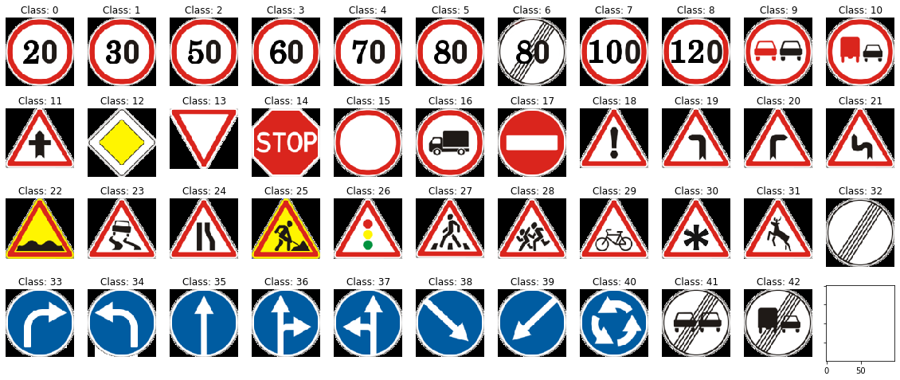


```python
# Let's have a look at the distribution of the data though the differents classes
# This will be useful later ...

utils.classDistribution(train_data_set.labels)
```


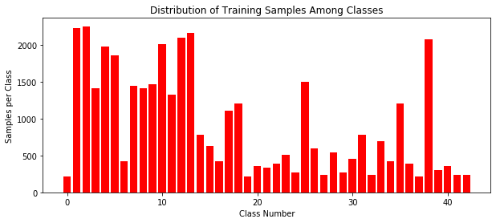


```python
# To explore the data in more details, we choose to represent each image width and height on a scatter plot

ws_train, hs_train = list(), list()
ws_test, hs_test = list(), list()
for img in train_data_set.X:
    ws_train.append(img.shape[0])
    hs_train.append(img.shape[1])
for img in test_data_set.X:
    ws_test.append(img.shape[0])
    hs_test.append(img.shape[1])

plt.figure(figsize=(16, 6))

plt.subplot(121)
plt.scatter(ws_train, hs_train, s=1, marker='.')
plt.xlabel('width')
plt.ylabel('height')
plt.xlim(0, 250)
plt.ylim(0, 300)
plt.title('Distribution of Image Sizes of The Training Dataset')

plt.subplot(122)
plt.scatter(ws_test, hs_test, s=1, marker='.', c='r')
plt.xlabel('width')
plt.ylabel('height')
plt.xlim(0, 250)
plt.ylim(0, 300)
plt.title('Distribution of Image Sizes of The Testing Dataset')
```


    Text(0.5, 1.0, 'Distribution of Image Sizes of The Testing Dataset')


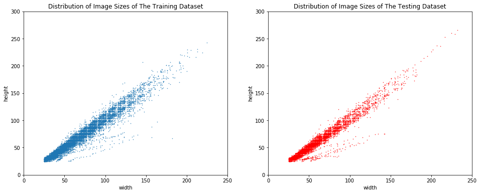


```python
# Randomly pick and show 22 images from the tarining data

random.seed(8)
rand_imgs = random.sample(list(train_data_set.X), 22)
utils.plotImages(rand_imgs)
```


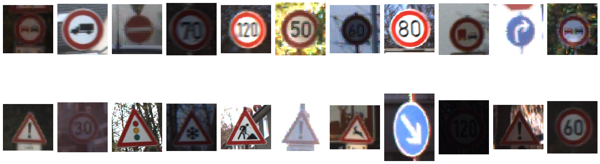


# Data Preprocessing


```python
# Rshaping to 32x32 images and converting to grayscale

reshaped_train_images = []
for image in train_data_set.X:
    dst = pre.eqHist(image)
    dst = pre.reshape(dst, 32)
    reshaped_train_images.append(dst)
train_data_set.X = reshaped_train_images

reshaped_test_images = []
for image in test_data_set.X:
    dst = pre.eqHist(image)
    dst = pre.reshape(dst, 32)
    reshaped_test_images.append(dst)
test_data_set.X = reshaped_test_images
```


```python
# Now, all samples have the same size

random.seed(8)
utils.plotImages(random.sample(train_data_set.X, 22), cmap='gray')
```


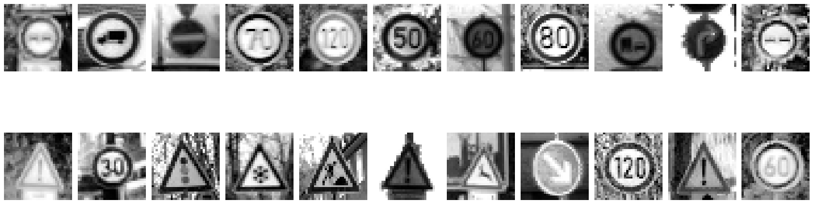


# Training a NN model

For this model, the input is a $d\times1$ vector containing the values of the image pixels (from 0 to 255 before normalization). 


```python
reshaped_train_images = []
for image in train_data_set.X:
    # convert each image to a vector
    dst = image.reshape(-1,1)
    reshaped_train_images.append(dst)
# normalize in order to get values between 0 and 1
train_data_set.X = np.asarray(reshaped_train_images) / 255.
```


```python
reshaped_test_images = []
for image in test_data_set.X:
    # convert each image to a vector
    dst = image.reshape(-1,1)
    reshaped_test_images.append(dst)
# normalize in order to get values between 0 and 1
test_data_set.X = np.asarray(reshaped_test_images) / 255.
```


```python
# Create the MLP model

mlp = nn.MLP("NN.dat", train_data_set, print_step=1, verbose=1)
```


```python
# TRAINING THIS MODEL COULD LAST FOR HOURS

mlp.train(n_epochs=5, learning_rate=1, decay=1.)
```


```python
mlp.make_plot()
```


```python
mlp.setdataset(test_data_set)
```


```python
mlp.print_accuracy()
```

# Training a CNN model


```python
from tensorflow.keras.models import Sequential
from tensorflow.keras.layers import Dense, Conv2D, Flatten, MaxPooling2D
from tensorflow.keras import optimizers
```


```python
# Linear stack of layers.
model = Sequential()
model.add(Conv2D(32, (3,3), activation='relu',
                 input_shape=(32, 32, 1))) # the input samples are images of size 32*32 with one channel
model.add(MaxPooling2D((2, 2)))
model.add(Conv2D(64, (3, 3), activation='relu'))
model.add(MaxPooling2D((2, 2)))
model.add(Conv2D(64, (3, 3), activation='relu'))
```


```python
model.summary()
```

    Model: "sequential"
    _________________________________________________________________
    Layer (type)                 Output Shape              Param #   
    =================================================================
    conv2d (Conv2D)              (None, 30, 30, 32)        320       
    _________________________________________________________________
    max_pooling2d (MaxPooling2D) (None, 15, 15, 32)        0         
    _________________________________________________________________
    conv2d_1 (Conv2D)            (None, 13, 13, 64)        18496     
    _________________________________________________________________
    max_pooling2d_1 (MaxPooling2 (None, 6, 6, 64)          0         
    _________________________________________________________________
    conv2d_2 (Conv2D)            (None, 4, 4, 64)          36928     
    =================================================================
    Total params: 55,744
    Trainable params: 55,744
    Non-trainable params: 0
    _________________________________________________________________


```python
model.add(Flatten())
model.add(Dense(64, activation='relu'))
model.add(Dense(43, activation='softmax'))
```


```python
model.summary()
```

    Model: "sequential"
    _________________________________________________________________
    Layer (type)                 Output Shape              Param #   
    =================================================================
    conv2d (Conv2D)              (None, 30, 30, 32)        320       
    _________________________________________________________________
    max_pooling2d (MaxPooling2D) (None, 15, 15, 32)        0         
    _________________________________________________________________
    conv2d_1 (Conv2D)            (None, 13, 13, 64)        18496     
    _________________________________________________________________
    max_pooling2d_1 (MaxPooling2 (None, 6, 6, 64)          0         
    _________________________________________________________________
    conv2d_2 (Conv2D)            (None, 4, 4, 64)          36928     
    _________________________________________________________________
    flatten (Flatten)            (None, 1024)              0         
    _________________________________________________________________
    dense (Dense)                (None, 64)                65600     
    _________________________________________________________________
    dense_1 (Dense)              (None, 43)                2795      
    =================================================================
    Total params: 124,139
    Trainable params: 124,139
    Non-trainable params: 0
    _________________________________________________________________


```python
from tensorflow.keras.utils import plot_model
plot_model(model, to_file='images/model.png', show_shapes=True, rankdir='LR')
```


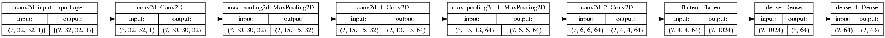


```python
train_data_set.X.shape
```


    (39209, 1024, 1)


```python
train_data_set.X = train_data_set.X.reshape(-1,32,32,1)# / 255.0
test_data_set.X = test_data_set.X.reshape(-1,32,32,1)# / 255.0
```


```python
new_y = list()
for y in train_data_set.y:
    new_y.append(np.argmax(y))
new_y = np.asarray(new_y).reshape(-1,1)
```


```python
new_y_test = list()
for y in test_data_set.y:
    new_y_test.append(np.argmax(y))
new_y_test = np.asarray(new_y_test).reshape(-1,1)
```


```python
train_data_set.X.shape, new_y.shape
```


    ((39209, 32, 32, 1), (39209, 1))


```python
model.compile(optimizer=optimizers.RMSprop(),
              loss='sparse_categorical_crossentropy',
              metrics=['accuracy'])

history = model.fit(train_data_set.X, new_y, validation_split=0.25, epochs=10)
```

    Train on 29406 samples, validate on 9803 samples
    Epoch 1/10
    29406/29406 [==============================] - 24s 816us/sample - loss: 0.9651 - accuracy: 0.7198 - val_loss: 27.1570 - val_accuracy: 0.0568
    Epoch 2/10
    29406/29406 [==============================] - 22s 746us/sample - loss: 0.1340 - accuracy: 0.9606 - val_loss: 27.8668 - val_accuracy: 0.0557
    Epoch 3/10
    29406/29406 [==============================] - 22s 736us/sample - loss: 0.0661 - accuracy: 0.9813 - val_loss: 24.1913 - val_accuracy: 0.0541
    Epoch 4/10
    29406/29406 [==============================] - 22s 764us/sample - loss: 0.0380 - accuracy: 0.9886 - val_loss: 30.2046 - val_accuracy: 0.0563
    Epoch 5/10
    29406/29406 [==============================] - 23s 794us/sample - loss: 0.0263 - accuracy: 0.9921 - val_loss: 28.2901 - val_accuracy: 0.0568
    Epoch 6/10
    29406/29406 [==============================] - 27s 932us/sample - loss: 0.0173 - accuracy: 0.9948 - val_loss: 34.7405 - val_accuracy: 0.0556
    Epoch 7/10
    29406/29406 [==============================] - 25s 838us/sample - loss: 0.0130 - accuracy: 0.9957 - val_loss: 33.3517 - val_accuracy: 0.0555
    Epoch 8/10
    29406/29406 [==============================] - 23s 773us/sample - loss: 0.0113 - accuracy: 0.9965 - val_loss: 30.3522 - val_accuracy: 0.0562
    Epoch 9/10
    29406/29406 [==============================] - 22s 765us/sample - loss: 0.0064 - accuracy: 0.9978 - val_loss: 36.1016 - val_accuracy: 0.0569
    Epoch 10/10
    29406/29406 [==============================] - 24s 807us/sample - loss: 0.0070 - accuracy: 0.9981 - val_loss: 32.7518 - val_accuracy: 0.0560


```python
# Plot training & validation accuracy values
plt.plot(history.history['accuracy'])
plt.plot(history.history['val_accuracy'])
plt.title('Model accuracy')
plt.ylabel('Accuracy')
plt.xlabel('Epoch')
plt.legend(['Train', 'Test'], loc='upper left')
plt.show()

# Plot training & validation loss values
plt.plot(history.history['loss'])
plt.plot(history.history['val_loss'])
plt.title('Model loss')
plt.ylabel('Loss')
plt.xlabel('Epoch')
plt.legend(['Train', 'Test'], loc='upper left')
plt.show()
```


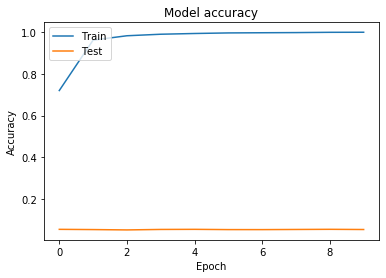


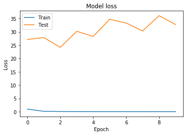


```python
model.metrics_names
```


    ['loss', 'accuracy']


```python
loss_and_metrics = model.evaluate(test_data_set.X, new_y_test, verbose=0)
```


```python
loss_and_metrics
```


    [8.373822529053555, 0.73198736]


```python
# Data augmentation: generate fake data from the existing images

fake_data_dir, fake_labels_path = "data/gtsrb-german-traffic-sign/augmented/train", "data/gtsrb-german-traffic-sign/augmented/Train_augmented.csv"
fake_data_set = nn.Dataset(fake_data_dir, fake_labels_path, data='augmented', n_samples=30000)
```


```python
utils.classDistribution(fake_data_set.labels)
```


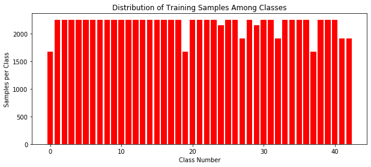


```python
# Rshaping to 32x32 images and converting to grayscale

reshaped_fake_images = []
for image in fake_data_set.X:
    dst = pre.eqHist(image)
    dst = pre.reshape(dst, 32)
    reshaped_fake_images.append(dst)
fake_data_set.X = reshaped_fake_images
```


```python
# normalize in order to get values between 0 and 1
fake_data_set.X = np.asarray(fake_data_set.X).reshape(-1,32,32,1) / 255.
```


```python
new_fake_y = list()
for y in fake_data_set.y:
    new_fake_y.append(np.argmax(y))
new_fake_y = np.asarray(new_fake_y).reshape(-1,1)
```


```python
# Linear stack of layers.
model_2 = Sequential()
model_2.add(Conv2D(32, (3,3), activation='relu',
                 input_shape=(32, 32, 1))) # the input samples are images of size 32*32 with one channel
model_2.add(MaxPooling2D((2, 2)))
model_2.add(Conv2D(64, (3, 3), activation='relu'))
model_2.add(MaxPooling2D((2, 2)))
model_2.add(Conv2D(64, (3, 3), activation='relu'))
model_2.add(Flatten())
model_2.add(Dense(64, activation='relu'))
model_2.add(Dense(43, activation='softmax'))
```


```python
model_2.compile(optimizer=optimizers.RMSprop(),
              loss='sparse_categorical_crossentropy',
              metrics=['accuracy'])

history_2 = model_2.fit(fake_data_set.X, new_fake_y, validation_split=0.25, epochs=10)
```

    Train on 22500 samples, validate on 7500 samples
    Epoch 1/10
    22500/22500 [==============================] - 17s 745us/sample - loss: 1.1806 - accuracy: 0.6726 - val_loss: 0.3273 - val_accuracy: 0.8951
    Epoch 2/10
    22500/22500 [==============================] - 16s 721us/sample - loss: 0.1688 - accuracy: 0.9496 - val_loss: 0.1725 - val_accuracy: 0.9475
    Epoch 3/10
    22500/22500 [==============================] - 18s 796us/sample - loss: 0.0664 - accuracy: 0.9792 - val_loss: 0.0559 - val_accuracy: 0.9839
    Epoch 4/10
    22500/22500 [==============================] - 19s 826us/sample - loss: 0.0344 - accuracy: 0.9899 - val_loss: 0.0527 - val_accuracy: 0.9844
    Epoch 5/10
    22500/22500 [==============================] - 17s 746us/sample - loss: 0.0221 - accuracy: 0.9932 - val_loss: 0.0460 - val_accuracy: 0.9867
    Epoch 6/10
    22500/22500 [==============================] - 18s 795us/sample - loss: 0.0143 - accuracy: 0.9951 - val_loss: 0.0351 - val_accuracy: 0.9897
    Epoch 7/10
    22500/22500 [==============================] - 17s 748us/sample - loss: 0.0098 - accuracy: 0.9969 - val_loss: 0.0278 - val_accuracy: 0.9928
    Epoch 8/10
    22500/22500 [==============================] - 17s 767us/sample - loss: 0.0099 - accuracy: 0.9966 - val_loss: 0.0474 - val_accuracy: 0.9896
    Epoch 9/10
    22500/22500 [==============================] - 17s 769us/sample - loss: 0.0073 - accuracy: 0.9976 - val_loss: 0.0605 - val_accuracy: 0.9861
    Epoch 10/10
    22500/22500 [==============================] - 17s 774us/sample - loss: 0.0091 - accuracy: 0.9973 - val_loss: 0.0302 - val_accuracy: 0.9927


```python
# Plot training & validation accuracy values
plt.plot(history_2.history['accuracy'])
plt.plot(history_2.history['val_accuracy'])
plt.title('Model accuracy')
plt.ylabel('Accuracy')
plt.xlabel('Epoch')
plt.legend(['Train', 'Test'], loc='upper left')
plt.show()

# Plot training & validation loss values
plt.plot(history_2.history['loss'])
plt.plot(history_2.history['val_loss'])
plt.title('Model loss')
plt.ylabel('Loss')
plt.xlabel('Epoch')
plt.legend(['Train', 'Test'], loc='upper left')
plt.show()
```


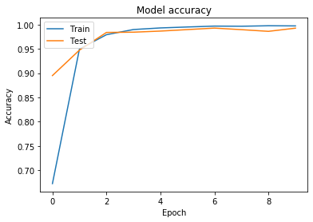


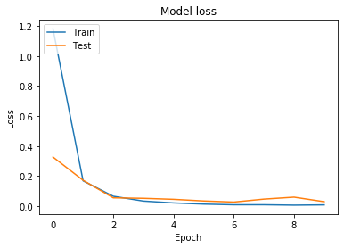


```python
loss_and_metrics_2 = model_2.evaluate(test_data_set.X, new_y_test, verbose=0)
```


```python
loss_and_metrics_2
```


    [1.5791984968872554, 0.83032465]


For the full code, check the Gitlab repository.
